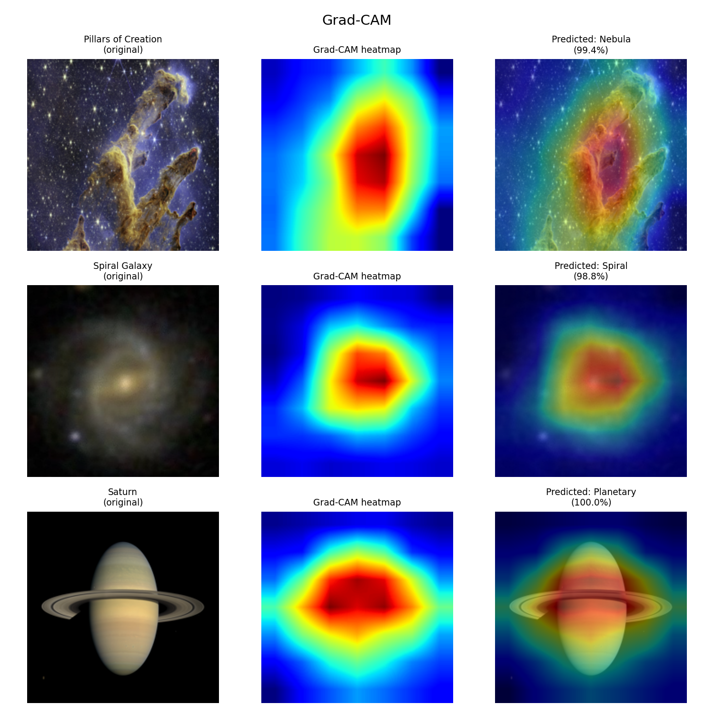

#  Astronomical Image Classifier

A deep learning project that classifies astronomical images into 7 broad categories, with sub-classifiers for planetary objects and nebula types.

## Demo

Upload any astronomical image and get:
- **Main classification** (galaxy type, nebula, planet, star cluster)
- **Sub-classification** for planets (Saturn, Jupiter, Mars, etc.) and nebulae (Emission, Planetary, Supernova Remnant, etc.)
- **Grad-CAM visualization** showing what the model focused on



## Results

| Model | Classes | Test Accuracy |
|---|---|---|
| Main classifier | 7 | **93.25%** |
| Planetary sub-classifier | 10 | **100%** |
| Nebula sub-classifier | 5 | **89.87%** |

## Architecture

- **Backbone:** EfficientNet-B0 pretrained on ImageNet
- **Training:** 2-phase (frozen backbone → full fine-tuning)
- **Explainability:** Grad-CAM on last convolutional layer
- **Framework:** PyTorch + Streamlit

## Dataset

| Source | Classes | Images |
|---|---|---|
| Galaxy10 DECaLS | Merging, Elliptical, Spiral, Edge-on | 16,655 |
| Kaggle space-images | Nebula, Star Cluster | 350 → augmented to 800 each |
| Planets & Moons Dataset | 10 planet/moon types | 149 each → augmented to 500 |
| Nebula Images Dataset | 5 nebula types | 57–741 → augmented to 300 each |

## Classes

**Main classifier (7 classes):**
- Merging Galaxy
- Elliptical Galaxy
- Spiral Galaxy
- Edge-on Galaxy
- Nebula → triggers nebula sub-classifier
- Planetary Object → triggers planet sub-classifier
- Star Cluster

**Planetary sub-classifier (10 classes):**
Mercury, Venus, Earth, Mars, Jupiter, Saturn, Uranus, Neptune, Pluto, Moon

**Nebula sub-classifier (5 classes):**
Dark Nebula, Emission Nebula, Planetary Nebula, Reflection Nebula, Supernova Remnants

## Project Structure

```
astro_classifier/
├── app/
│   └── app.py              # Streamlit web app
├── notebooks/
│   ├── 01_eda.ipynb        # EDA, training, evaluation
│   └── 02_SubClassifier.ipynb  # Sub-classifier training
├── src/
│   ├── data/
│   │   └── dataset.py      # Dataset pipeline
│   ├── models/
│   │   ├── model.py        # EfficientNet-B0 builder
│   │   └── trainer.py      # Training loop
│   └── train.py            # Main training script
└── outputs/
    ├── figures/            # Confusion matrices, samples
    └── gradcam/            # Grad-CAM visualizations
```

## Setup

```bash
# Clone the repo
git clone https://github.com/Rishiii57/astro_classifier.git
cd astro_classifier

# Create virtual environment
python3 -m venv .venv
source .venv/bin/activate

# Install dependencies
pip install torch torchvision streamlit scikit-learn matplotlib pillow numpy h5py
```

## Running the App

```bash
cd app
streamlit run app.py
```

## Training

Download the datasets:
- [Galaxy10 DECaLS](https://astronn.readthedocs.io/en/latest/galaxy10.html)
- [Kaggle space-images](https://www.kaggle.com/datasets/abhikalpsrivastava15/space-images-category)
- [Planets & Moons Dataset](https://www.kaggle.com/datasets/emirhanai/planets-and-moons-dataset-ai-in-space)
- [Nebula Images](https://www.kaggle.com/datasets/helodrys/nebula-images)

Then run:
```bash
python3 src/train.py
```

## Technologies

- Python 3.11
- PyTorch 2.x + torchvision
- EfficientNet-B0
- Streamlit
- scikit-learn
- Grad-CAM (custom implementation)

## Author

**Rishi Kumar** , IIT Gandhinagar  
GitHub: [@Rishiii57](https://github.com/Rishiii57)
